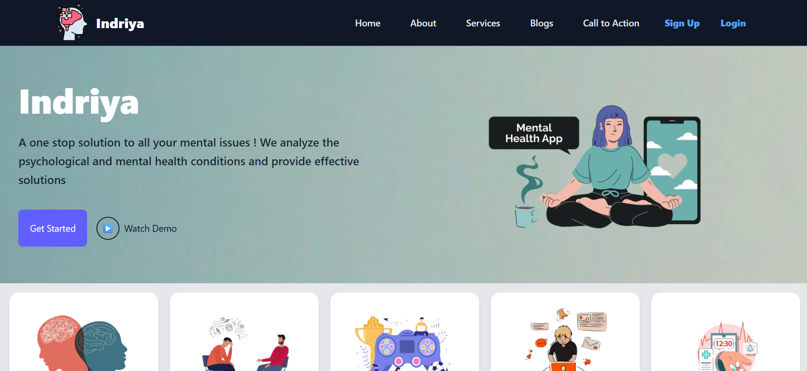
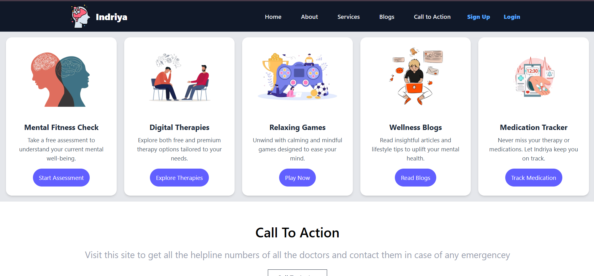
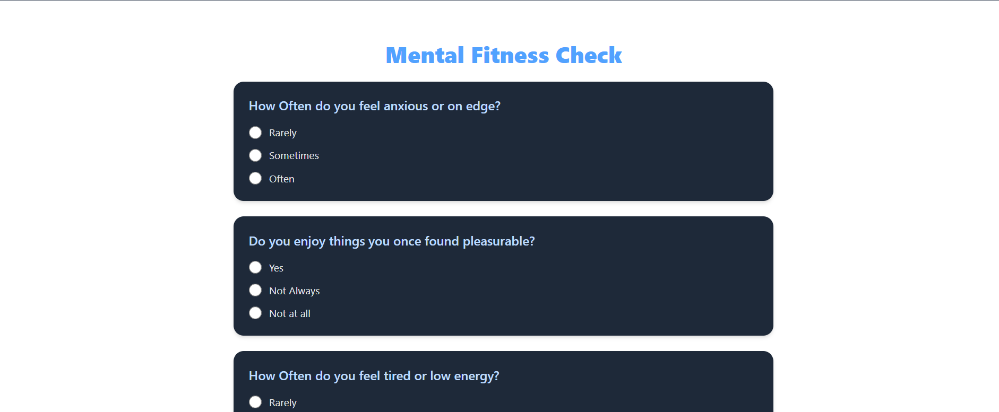
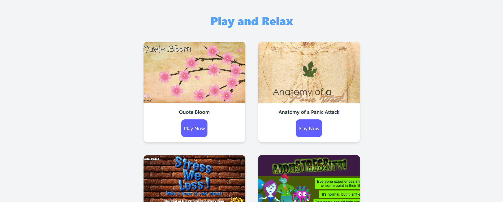
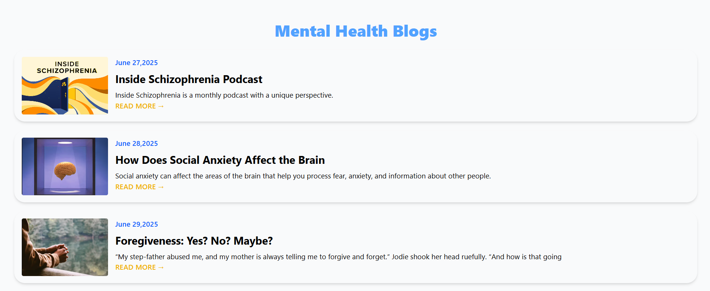
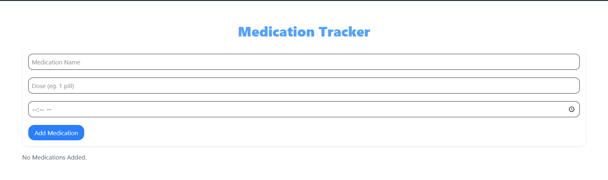

Got it! I’ll revise your `README.md` with proper Markdown, update the `cd` command, and include your screenshots for better visual context. Here’s the improved version:

---

# Indriya

Indriya is a **one-stop digital solution for mental health and wellness**. From analyzing your psychological and mental health conditions to providing effective solutions, therapies, relaxing games, wellness blogs, and tools like a medication tracker — Indriya supports your journey to better mental well-being.

---

## ✨ Features

- **Mental Fitness Check** — Take a free assessment to understand your current mental well-being.
- **Digital Therapies** — Access free and premium therapy options tailored to your needs.
- **Relaxing Games** — Unwind with calming and mindful games.
- **Wellness Blogs** — Read insightful articles and lifestyle tips.
- **Medication Tracker** — Stay on top of your therapy and medication schedule.
- **Emergency Helpline** — Quick access to helpline numbers and doctors in case of emergencies.

---

## 🖼️ Preview

### 🏠 Home



### 🧩 Services



### ✅ Mental Fitness Check (Assessment)



### 🎮 Relaxing Games



### 📰 Wellness Blogs



### 💊 Medication Tracker



### 📞 Call to Action


---

## 🧩 Tech Stack

- **Frontend:** React.js
- **Styling:** Tailwind CSS

---

## 🚀 Getting Started

1. **Clone the repository**

   ```bash
   git clone https://github.com/Ayanonmyous/indriya.git
   cd indriya
   ```

2. **Install dependencies**

   ```bash
   npm install
   ```

3. **Run the app**

   ```bash
   npm start
   ```

4. Open [http://localhost:5173](http://localhost:5173) to view it in the browser.

---

Let me know if you’d like a version with custom badges, contributor section, or deployment instructions! 🚀
